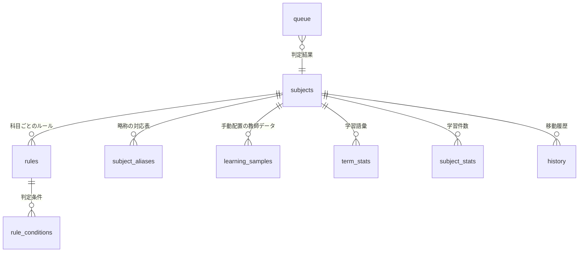

# データベース層 仕様書

ダウンロードフォルダ自動振り分けアプリ（Electron / better-sqlite3）の DB 担当分。
**ESM（`import`記法）で書かれています。** sorter が `"type": "module"` のため揃えました。

## 1. ファイル構成

配置場所は `back/`。

| ファイル | 役割 |
|---|---|
| `db.js` | **他メンバーが使う入口。** 接続・CRUD・判定・学習をまとめたもの |
| `migrations.js` | テーブル定義（DDL）。バージョン管理付き |
| `matcher.js` | ルール判定エンジン（ファイル名・拡張子・本文・サイズ） |
| `learner.js` | 正規化・ファイル名解析・ナイーブベイズ。純粋関数のみ |
| `extract.js` | PDF/Word から本文テキストを取り出す |
| `db-resolver.js` | **sorter との接続アダプタ**（監視 → 判定 → 移動 → 履歴） |
| `inspect.js` | 実ファイルを調べる調査CLI |
| `test-db.js` | 動作確認スクリプト |

```bash
npm install                    # better-sqlite3
npm i pdfjs-dist mammoth       # 本文抽出を使う場合（純JS。exe化しても壊れない）
npm run test:db                # 全機能の動作確認
```

> `better-sqlite3` はネイティブモジュール。Electron で使う前に `npx electron-rebuild` が必要。
> electron-builder の `build.asarUnpack` に `**/node_modules/better-sqlite3/**` を追加すること。

DBの保存先は既定で `app.getPath('userData')/filesorter.db`（Windows は `%APPDATA%\<アプリ名>\`）。

---

## 2. 判定の仕組み（3段構え）

```
db.classify({ fileName, ext, sizeBytes, text })
   │
   ├─ 1. ルール          ユーザーが作った明示的な条件。決定的・最優先
   ├─ 2. 別名（alias）   prg1 → 知能情報プログラミング１
   └─ 3. 学習            手動配置の履歴からナイーブベイズで推定
                         確信度が低ければ matched:false + suggestions を返す
```

### なぜ「別名」が必要か

実ファイルを調べた結果、**ファイル名の科目略称がフォルダ名と一致しません。**

| ファイル名 | 実際の科目 | 共通文字 |
|---|---|---|
| `PD入門_2026_w13_おもちゃ開発3.pdf` | プロジェクト演習入門 | 「入門」だけ |
| `prg1_202604_w11p_演習.pdf` | 知能情報プログラミング１ | **ゼロ** |
| `ICT入門⑧.pdf` | ICT入門 | 一致する（例外） |

科目名の部分一致では永久に当たらないため、`subject_aliases` テーブルで対応表を持ちます。
科目を作ると科目名は自動的に別名として登録されるので、`ICT入門` は設定不要で当たります。

### 本文（PDF）での判定 ← 実は最も確実

実際の授業スライドを解析して分かったこと。

**授業スライドは全ページのフッターに科目名が入っています。** PowerPointのスライドマスターに
設定されているためで、ファイル名がどれだけ雑でも本文から科目を特定できます。

```
ICT入門⑧.pdf         → 全ページ下部に「ICT入門」（13回出現）
prg1_..._演習.pdf     → 全ページ下部に「プログラミングI・知能情報プログラミングI 第11週」
```

ただし2つ落とし穴があります。

**① 他科目の名前も本文に出てくる。**
ICT入門の資料に「次回よりデータサイエンス入門が始まります」と3回書かれていました。
「含まれるか」で判定すると、より長い `データサイエンス入門`(10文字) が
`ICT入門`(6文字) に勝って**誤爆します**。
そのため **出現回数を掛けてスコアリング**しています（ICT入門 6×10=60 vs DS入門 10×3=30）。

**② 全角の「１」とローマ数字の「I」は別文字。**

| | 表記 | NFKC後 |
|---|---|---|
| フォルダ名 | 知能情報プログラミング**１** | `...ミング1` |
| 資料の本文 | 知能情報プログラミング**I** | `...ミングi` |

NFKCだけでは一致しません。`normalizeSubjectKey()` で
日本語の直後のローマ数字を算用数字に変換して吸収しています。

### 正規化について

比較・学習の前に必ず **NFKC正規化 + 小文字化** します。

- `⑧` → `8` （丸数字。「第8回」の意味なので週番号として別枠で抽出）
- `１` → `1` （全角数字。イングリッシュトピックス１ ↔ …1）
- `Ａ` → `a` / `ｱ` → `ア`

これを入れないと全角・半角違いで完全に取りこぼします。

### ファイル名から構造を取り出す

```js
parseFileName('prg1_202604_w11p_演習.pdf')
// {
//   normalized: 'prg1_202604_w11p_演習',
//   head: 'prg1',        ← 科目略称。学習時に3倍の重みをつける
//   headStem: 'prg',
//   week: 11,            ← w13 / w11p / ⑧ / 第3回 に対応
//   date: { year: 2026, month: 4, day: null },
//   tokens: ['prg1','prg','演習']   ← 週番号・日付は除去済み
// }
```

週番号と日付は毎回変わるため語彙から除外しています。
同時に、これは「提出日ごとの振り分け」機能にそのまま使えます。

---

## 3. テーブル構成



| テーブル | 内容 |
|---|---|
| `settings` | 監視フォルダ・自動移動ON/OFF などの設定（key-value） |
| `subjects` | 科目 ＝ 振り分け先フォルダ。**同じフォルダを複数科目が指せる** |
| `subject_aliases` | 科目の別名・略称（v2で追加） |
| `rules` / `rule_conditions` | 振り分けルールと条件 |
| `content_cache` | 抽出した本文。ハッシュをキーに再解析を防ぐ |
| `queue` | chokidar が検知した未処理ファイル |
| `history` | 移動履歴。Undo と統計に使う |
| `learning_samples` | 手動配置の記録（教師データ） |
| `term_stats` / `subject_stats` | 学習した語の統計 |

### 条件で指定できるもの

| target | `filename` `extension` `content` `any_text` `size` |
|---|---|
| operator | `contains` `not_contains` `equals` `starts_with` `ends_with` `in` `regex` `gt` `lt` |

`match_mode` が `all` なら全条件AND、`any` ならOR。`priority` が大きいほど優先。

---

## 4. API

### 初期化
```js
import * as db from './back/db.js';
db.init({ dbPath });   // 省略時は userData 配下
db.close();
db.maintenance();      // 古い履歴・キャッシュの削除
```

### 科目
```js
db.subjects.list() / get(id) / getByName(name) / getByFolder(path)
db.subjects.create({ name, folderPath, color })      // 科目名は自動で別名になる
db.subjects.update(id, patch) / remove(id) / reorder([ids])

// フォルダを指定するだけで科目を一括登録（「A,B」は2科目に分割して同じフォルダを指す）
db.subjects.importFromFolder('D:\\大学\\2026前期')
```

### 別名
```js
db.aliases.add(subjectId, 'prg1')
db.aliases.addMany(subjectId, ['prg1', 'prg', 'プログラミング演習'])
db.aliases.list(subjectId) / remove(id)
db.aliases.match({ fileName, text })   // 先頭一致 > ファイル名部分一致 > 本文部分一致
```

### ルール
```js
db.rules.create({ subjectId, name, conditions:[...], matchMode, priority, subfolder })
db.rules.list({ subjectId }) / get(id) / update(id, patch) / setEnabled(id, bool) / remove(id)
```

### 判定
```js
const r = db.classify({ fileName, ext, sizeBytes, text });
// r.matched, r.source('rule'|'alias'|'learning'), r.subjectId, r.folderPath,
// r.subfolder, r.matchedBy, r.confidence, r.week, r.date, r.suggestions
```

### 学習
```js
db.learn.record({ subjectId, fileName, ext, text, source })
//   source: 'manual_move' | 'correction'(重み2倍) | 'confirm' | 'import'
//   先頭トークンは別名候補としても自動登録される
db.learn.suggest({ fileName, text })
db.learn.promoteToRule(subjectId)   // 学習結果を編集可能なルールに昇格
db.learn.stats() / samples() / forget(subjectId) / rebuild()
```

### 本文抽出
```js
import { extractText, extractWithCache, hashFile } from './db/extract.js';
await extractText('C:\\...\\file.pdf');          // { text, extractor, pages, truncated, error }
await extractWithCache(db, filePath);            // content_cache 経由（推奨）
```
未インストールでも例外は投げず「本文なし」として扱うので、アプリは落ちません。

### 履歴・キュー
```js
db.history.add({...}) / list({...}) / markUndone(id) / findByHash(hash) / stats(30)
db.queue.add({ sourcePath }) / list(status) / setStatus(id, status, {...}) / clearDone()
```

---

## 5. sorter との接続

`sorter.js` への変更は3か所だけです。詳細は `db-resolver.js` の冒頭コメントに記載。

```js
import * as db from './back/db.js';
import { createResolver, recordMove, recordFailure } from './back/db-resolver.js';
import { Sorter } from './sorter/src/sorter.js';

db.init();
const sorter = new Sorter(config, { journalPath, resolver: createResolver(db) });
sorter.on('moved',  (rec) => recordMove(db, rec));
sorter.on('failed', (err) => recordFailure(db, err));
await sorter.start();
```

- `journal.jsonl` は Undo の安全装置としてそのまま残します（追記のみで壊れにくいため）
- `history` テーブルは UI表示・統計・学習用のミラーとして併用します

初回セットアップ用に、既に手で整理済みのフォルダから一括学習する関数もあります。

```js
import { bootstrapLearningFromFolders } from './back/db-resolver.js';
db.subjects.importFromFolder('D:\\大学\\2026前期');
await bootstrapLearningFromFolders(db);   // 各科目フォルダの既存ファイルを教師データにする
```

---

## 6. 調査CLI

実ファイルの本文に科目名が入っているか確認できます。

```bash
node back/inspect.js "C:\Users\me\Downloads\ICT入門⑧.pdf"
node back/inspect.js --root "D:\大学\2026前期" "C:\...\prg1_202604_w11p_演習.pdf"
node back/inspect.js --full "C:\...\file.pdf"     # 本文を全部出力
```

出力されるもの: NFKC正規化後のファイル名 / 先頭トークン / 週番号 / 日付 / トークン一覧 /
抽出した本文 / **科目名がファイル名・本文のどちらに含まれるか**。

`--root` を付けると、そのフォルダのサブフォルダ名を科目名とみなして判定します。
「本文に含まれる」と出れば、本文条件のルールだけで初回から振り分けられます。

---

## 7. スキーマを変更したいとき

`migrations.js` の**既存SQLは絶対に書き換えない**。
新しい `{ version: 3, name:'...', sql:'ALTER TABLE ...' }` を配列に追加する。
`db.init()` が `PRAGMA user_version` を見て未適用分だけ実行するので、
すでにDBを持っているメンバーの環境も壊れません。
