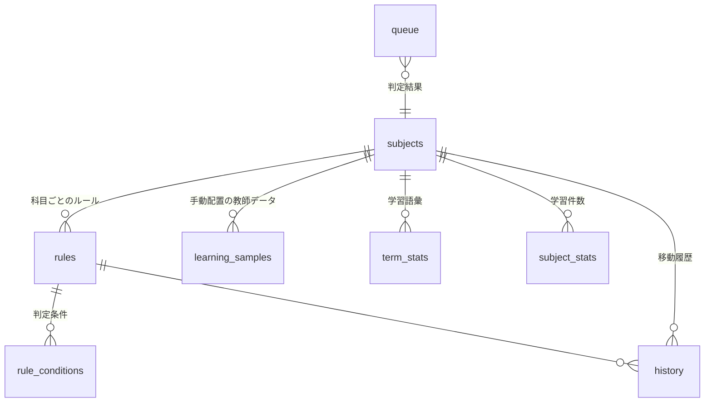

# データベース層 仕様書

ダウンロードフォルダ自動振り分けアプリ（Electron / better-sqlite3）の DB 担当分。

## 1. ファイル構成

配置場所は `src/db/` を想定（4ファイルとも同じフォルダに置く）。

| ファイル | 役割 |
|---|---|
| `migrations.js` | テーブル定義（DDL）。バージョン管理付き |
| `matcher.js` | ルール判定エンジン（ファイル名・拡張子・本文・サイズ） |
| `learner.js` | 自動学習のコア（トークナイザ＋ナイーブベイズ）。純粋関数のみ |
| `db.js` | **他メンバーが使う入口。** 接続・CRUD・判定・学習をまとめたもの |
| `test-db.js` | 動作確認スクリプト |

```bash
npm install better-sqlite3
node test-db.js          # 全機能の動作確認（メモリDBを使うのでファイルは残らない）
```

> `better-sqlite3` はネイティブモジュールなので、Electron で使う前に
> `npx electron-rebuild` （または `npm i -D @electron/rebuild`）が必要。
> electron-builder の `build.asarUnpack` に `**/node_modules/better-sqlite3/**` を追加すること。

DBファイルの保存先は既定で `app.getPath('userData')/filesorter.db`（Windowsなら `%APPDATA%\<アプリ名>\filesorter.db`）。

---

## 2. テーブル構成



| テーブル | 内容 |
|---|---|
| `settings` | 監視フォルダ・自動移動ON/OFF などのアプリ設定（key-value） |
| `subjects` | 科目 ＝ 振り分け先フォルダ（名前・パス・色・並び順） |
| `rules` | 振り分けルール。1ルール = 1科目。`priority` が大きいほど優先 |
| `rule_conditions` | ルールの条件。`match_mode='all'` ならAND、`'any'` ならOR |
| `content_cache` | PDF/Word から抽出した本文。ハッシュをキーに再解析を防ぐ |
| `queue` | chokidar が検知した未処理ファイルの作業キュー |
| `history` | 移動履歴。「元に戻す」と統計グラフに使う |
| `learning_samples` | **手動配置の記録（教師データ）** |
| `term_stats` | 学習した語 × 科目 の出現回数 |
| `subject_stats` | 科目ごとの学習件数（ベイズの事前確率用） |

ビュー `v_rules_full`（ルール＋科目名）、`v_history_full`（履歴＋科目名）も用意。

### 条件（`rule_conditions`）で指定できるもの

| target | 意味 |
|---|---|
| `filename` | ファイル名 |
| `extension` | 拡張子（`pdf` のようにドット無し） |
| `content` | 抽出した本文 |
| `any_text` | ファイル名＋本文 |
| `size` | バイト数（`gt` / `lt` / `equals`） |

| operator | 意味 |
|---|---|
| `contains` / `not_contains` | 含む / 含まない |
| `equals` / `starts_with` / `ends_with` | 一致 / 前方一致 / 後方一致 |
| `in` | カンマ区切りのいずれか（例: `pdf,docx`） |
| `regex` | 正規表現（不正な式は「不一致」扱いで落ちない） |
| `gt` / `lt` | サイズ比較 |

---

## 3. API 一覧（`require('./db')`）

### 初期化
```js
db.init({ dbPath })   // 起動時に1回。省略時は userData 配下
db.close()            // 終了時
db.backup(path)       // バックアップ
db.maintenance()      // 古い履歴・キャッシュの削除（起動時に呼ぶと良い）
```

### 設定
```js
db.settings.get(key, default)      db.settings.getBool(key)   db.settings.getNumber(key)
db.settings.getAll()               db.settings.set(key, val)  db.settings.setMany({...})
```

### 科目
```js
db.subjects.list({ includeDisabled })
db.subjects.get(id) / getByName(name) / getByFolder(path)
db.subjects.create({ name, folderPath, color, icon, sortOrder, enabled })  // → id
db.subjects.update(id, { name, folderPath, color, enabled, ... })
db.subjects.remove(id)             // ルール・学習データもCASCADEで削除
db.subjects.reorder([id, id, ...])
```

### ルール
```js
db.rules.list({ subjectId, includeDisabled, origin })
db.rules.get(id)                   // conditions 付き
db.rules.getActive()               // 判定用（キャッシュ済み）
db.rules.create({ subjectId, name, conditions:[...], matchMode, priority, subfolder })
db.rules.update(id, patch)         // conditions を渡すと総入れ替え
db.rules.setEnabled(id, bool)      db.rules.remove(id)
```

### 判定（振り分け担当が呼ぶメイン関数）
```js
const r = db.classify({ fileName, ext, sizeBytes, text });
// r = {
//   matched:     true/false,
//   source:      'rule' | 'learning' | null,
//   subjectId, subjectName, folderPath, subfolder,
//   ruleId, matchedBy: 'filename'|'content'|'both',
//   confidence:  0.0-1.0,
//   suggestions: [ {subjectId, subjectName, probability}, ... ]  // 未確定時の候補
// }
```

判定の流れ:

1. **ルール**（決定的）を priority 順に評価 → 当たれば確定
2. 当たらなければ **学習による推定**
3. 確信度が `learning_min_confidence`（既定0.6）未満なら `matched:false` ＋ `suggestions` を返す
   → UI で「この科目でいい？」と確認する用

### 手動配置による自動学習
```js
// ユーザーが手でフォルダに入れた / AIの判定を直した ときに呼ぶ
db.learn.record({ subjectId, fileName, ext, text, fileHash, source });
//   source: 'manual_move'（手動配置） | 'correction'（誤判定の修正・重み2倍）
//         | 'confirm'（提案を承認）  | 'import'（初回の一括取り込み）

db.learn.suggest({ fileName, text, topK })   // 推定結果（確率つき）
db.learn.distinctiveTerms(subjectId)         // その科目を特徴づける語
db.learn.promoteToRule(subjectId)            // 学習結果を編集可能なルールに昇格
db.learn.stats()                             // 学習状況（設定画面用）
db.learn.samples({ subjectId, limit })       // 教師データ一覧
db.learn.forget(subjectId)                   // その科目の学習をリセット
db.learn.rebuild()                           // 統計を作り直す
```

**仕組み**: ファイル名と本文を語に分解（日本語は2文字N-gram、英数字は単語）して
`term_stats` に出現回数を貯め、ナイーブベイズで科目を推定する。
形態素解析器を使わないので追加の依存やモデルファイルが不要 ＝ exe 化しても壊れない。

安全装置として、既知語が2語未満のとき／学習済み科目が2つ未満のときは推定しない
（「サンプルが多い科目」に何でも吸い込まれるのを防ぐ）。

### キュー・履歴・キャッシュ
```js
db.queue.add({ sourcePath, sizeBytes, fileHash })   // chokidar検知時
db.queue.list(status)    db.queue.setStatus(id, status, { subjectId, ruleId, score })
db.queue.removeByPath(p) db.queue.clearDone()       db.queue.countByStatus()

db.history.add({ fileName, sourcePath, destPath, subjectId, ruleId, matchedBy, status })
db.history.list({ limit, offset, subjectId, status, keyword, days })
db.history.markUndone(id)          // 「元に戻す」実行後
db.history.findByHash(hash)        // 重複ファイルの検出
db.history.stats(30)               // ダッシュボード用の集計

db.content.get(fileHash)           db.content.put({ fileHash, text, extractor })
```

---

## 4. 他メンバーとの連携イメージ

**ファイル監視担当 → DB**
```js
chokidar.watch(downloadDir).on('add', async (p) => {
  const st = await fs.stat(p);
  const id = db.queue.add({ sourcePath: p, sizeBytes: st.size });
  const text = await extractText(p);            // PDF/Word 本文（無ければ null）
  const r = db.classify({ fileName: path.basename(p), ext: path.extname(p).slice(1),
                          sizeBytes: st.size, text });
  if (r.matched) db.queue.setStatus(id, 'matched', { subjectId: r.subjectId, ruleId: r.ruleId });
  else           db.queue.setStatus(id, 'unmatched', { suggested: r.suggestions });
});
```

**ファイル移動担当 → DB**
```js
await fs.rename(src, dest);
db.history.add({ fileName, sourcePath: src, destPath: dest,
                 subjectId: r.subjectId, ruleId: r.ruleId, matchedBy: r.matchedBy });
db.queue.setStatus(id, 'done');
```

**UI担当 → DB**（ipcMain 経由）
```js
ipcMain.handle('subjects:list',  ()          => db.subjects.list());
ipcMain.handle('rules:create',   (_e, p)     => db.rules.create(p));
ipcMain.handle('history:list',   (_e, p)     => db.history.list(p));
ipcMain.handle('history:stats',  ()          => db.history.stats(30));
// ユーザーが手動で振り分け先を選んだ／直した ＝ 学習チャンス
ipcMain.handle('learn:record',   (_e, p)     => db.learn.record(p));
```

---

## 5. スキーマを変更したいとき

`migrations.js` の**既存SQLは絶対に書き換えない**。
新しい `{ version: 2, name:'...', sql:'ALTER TABLE ...' }` を配列に追加する。
`db.init()` が `PRAGMA user_version` を見て未適用分だけ実行するので、
すでにDBを持っているメンバーの環境も壊れない。
